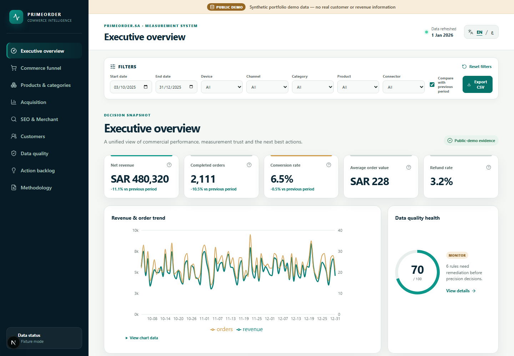

# PrimeOrder Commerce Intelligence

Ein öffentliches Portfolio-System für E-Commerce-Steuerung, Digital Analytics und belastbare Messqualität – entwickelt von **Omar Ba Jamel**.

> **Wichtiger Datenhinweis:** Die öffentliche Anwendung verwendet ausschließlich deterministisch erzeugte, synthetische Demodaten. Sie enthält keine echten Kunden-, Umsatz- oder Shopdaten von PrimeOrder.

[Live-Demo](https://omarbajamel.github.io/primeorder-commerce-intelligence/) · [GitHub-Release v1.0.0](https://github.com/OmarBajamel/primeorder-commerce-intelligence/releases/tag/v1.0.0) · [English README](README.md)



## Management Summary

Im E-Commerce liegen Umsatz, Verhalten, Kampagnen- und Suchdaten häufig in getrennten Systemen. Ohne klare KPI-Verantwortung entstehen schnell widersprüchliche Reports. Dieses Projekt führt Commerce-Daten, GA4-Funnel, Search Console, Merchant-Diagnosen, Clarity-Signale und Google-Ads-Fixtures in einem nachvollziehbaren Messsystem zusammen.

Der Schwerpunkt liegt nicht auf einer erfundenen Erfolgsstory, sondern auf der Frage: **Welche Entscheidung ist mit welcher Datenquelle belastbar – und welche Messlücke muss zuerst behoben werden?**

## Gelieferter Umfang

- Neun responsive Dashboard-Bereiche für Management-KPIs, Funnel, Produkte, Akquisition, SEO, Kunden, Datenqualität, Maßnahmen und Methodik.
- Englische und arabische Oberfläche mit visuell geprüftem RTL-Layout.
- Reproduzierbarer 365-Tage-Datensatz für einen saudischen Digital-Commerce-Kontext, Seed `20250301`, sechs bewusst eingebaute Qualitätsfehler.
- Sechs typisierte, ausschließlich lesende Konnektoren: PrimeOrder/Salla MCP, GA4, Search Console, Merchant Center, Microsoft Clarity und Google Ads.
- FastAPI-Service sowie ein unabhängiges DuckDB/dbt-Warehouse mit 28 Modellen und 78 Datentests.
- Messkonzept für elf GA4-E-Commerce-Events, Parameter-Vollständigkeit, Consent-Abdeckung und Quellabgleich.
- Statisches GitHub-Pages-Frontend ohne private API-Aufrufe oder Zugangsdaten.

## Verifizierte Qualität

- 10 Frontend-Unit-Tests und 26 Python-Tests bestanden.
- dbt: 117 von 117 Knoten erfolgreich, ohne Warnung oder Fehler.
- 17 Browser-/Accessibility-Prüfungen plus ein Test aller direkten GitHub-Pages-Routen.
- Acht echte Screenshots aus dem synthetischen Modus, jeweils mit Hash und manueller Datenschutzprüfung.
- Lighthouse Desktop: Performance 85, Accessibility 100, Best Practices 100, SEO 100.
- Öffentliche Release-Prüfung für Secrets, PII-Muster, private Pfade, Git-Historie, Frontend-Bundle und Archive bestanden.

## Fachlicher Ansatz

Die Datenhoheit ist explizit geregelt: Commerce verantwortet abgeschlossene Bestellungen, Umsatz, Erstattungen und verlässliche Kosten. GA4 verantwortet Sessions, aktive Nutzertage, Funnel-Events und getrackte Käufe. Google Ads verantwortet Spend und Anzeigen-Konversionen; Search Console verantwortet Klicks, Impressionen, CTR und Position.

Dadurch werden typische Fehler vermieden – etwa täglich aktive Nutzer als eindeutige Periodennutzer auszugeben oder Commerce-Bestellungen ungeprüft als GA4-Conversions zu verwenden.

## Datenschutz und Deutschland-Bezug

Das Projekt trennt `public-demo` und `live-private` technisch und organisatorisch. Private Exporte bleiben in ignorierten Pfaden. Die öffentliche Anwendung enthält keine personenbezogenen Daten und baut ohne Credentials. Consent-aware Measurement, Datenminimierung, Aufbewahrung, Incident Response und Release-Gates sind dokumentiert. Die Hinweise sind eine technische Portfolio-Dokumentation und keine Rechtsberatung.

## Schnellstart

Voraussetzungen: Node.js 22+, pnpm 11.15.1 und Python 3.12.

```bash
git clone https://github.com/OmarBajamel/primeorder-commerce-intelligence.git
cd primeorder-commerce-intelligence
make bootstrap
make demo
```

Danach ist die Anwendung unter `http://127.0.0.1:3000` erreichbar. Für den öffentlichen Demo-Modus werden keine Shop-, Google- oder Microsoft-Zugänge benötigt.

Weitere Nachweise: [Fallstudie](docs/case-study/CASE_STUDY.md), [deutsche Executive Summary](docs/case-study/EXECUTIVE_SUMMARY_DE.md), [KPI-Katalog](docs/analytics/KPI_CATALOG.md), [Testbericht](docs/testing/TEST_REPORT.md) und [Deutschland-Rollenprofil](docs/career/GERMANY_JOB_ALIGNMENT.md).

## Ehrliche Grenzen

Die Demodaten beweisen Umsetzungskompetenz, aber keine reale Umsatz-, Traffic- oder Conversion-Steigerung. Live-Konnektoren benötigen später eine separate, lesende Authentifizierung. Mobile Lighthouse-Performance bleibt wegen des vollständigen filterbaren Jahresdatensatzes schwächer als Desktop und ist im Testbericht offen dokumentiert.

Lizenz: [MIT](LICENSE).
