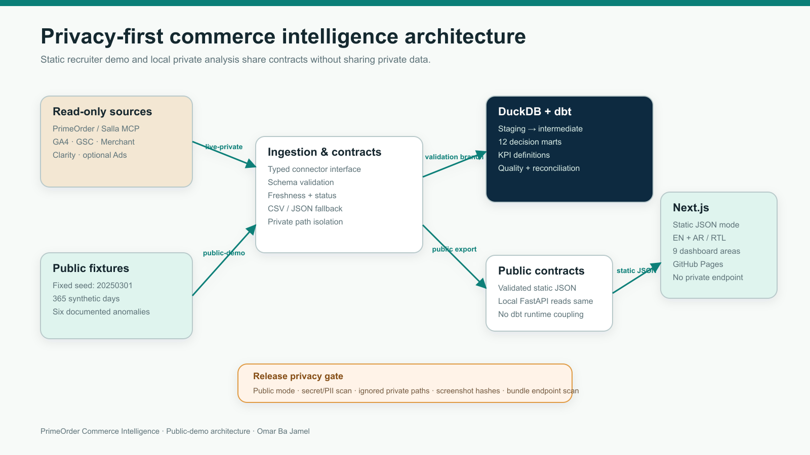
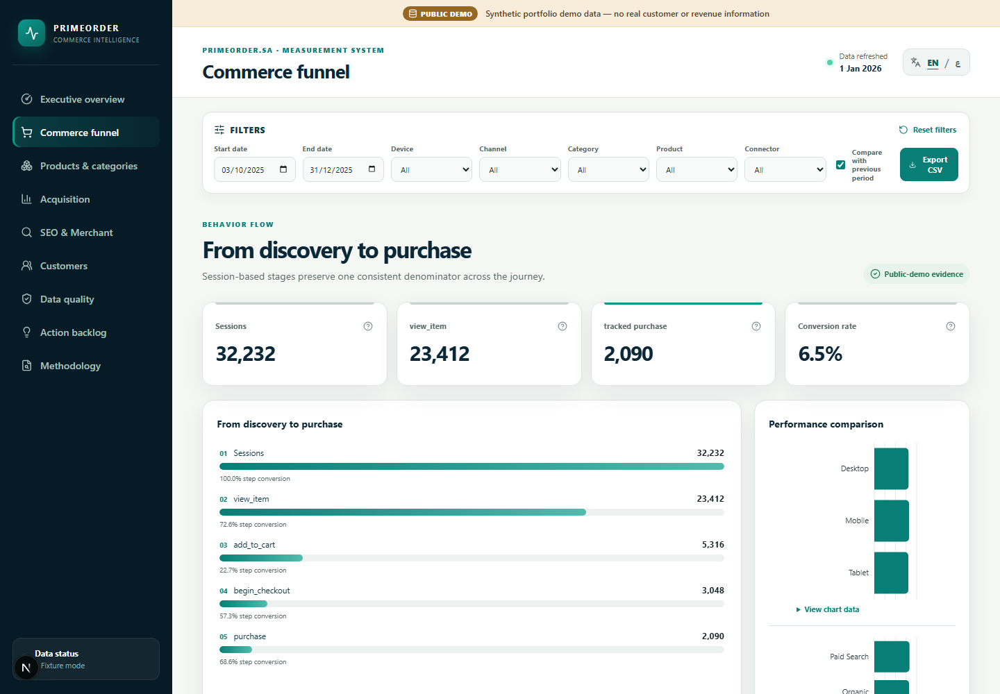
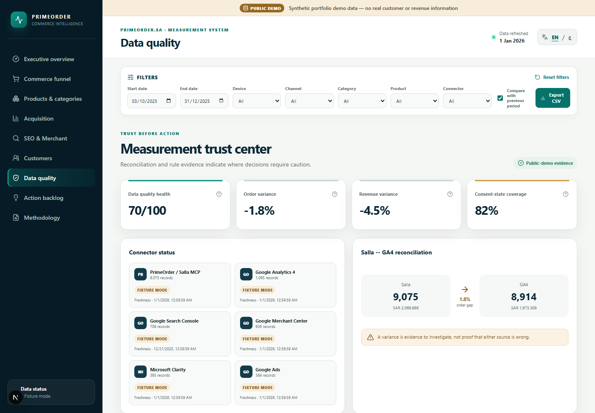
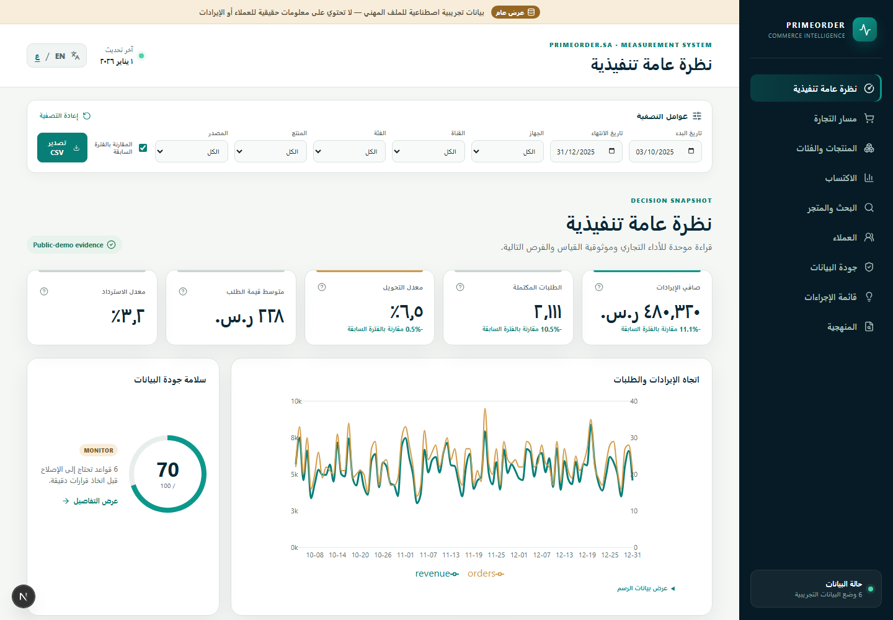
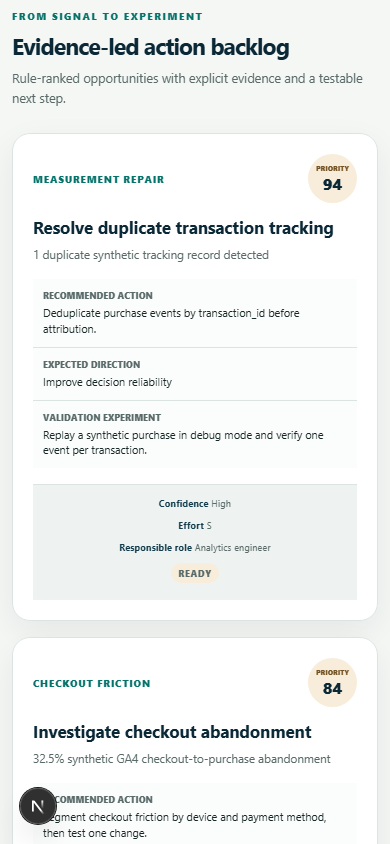

# PrimeOrder Commerce Intelligence

An evidence-first commerce measurement system that connects commercial KPIs, GA4 funnel quality, SEO, product performance, and source reconciliation in one recruiter-ready portfolio application.

> **Public-demo only:** Synthetic portfolio demo data — no real customer or revenue information. The fixed-seed dataset is independent of PrimeOrder’s private metrics.

[Live demo](https://omarbajamel.github.io/primeorder-commerce-intelligence/) · [v1.0.0 release](https://github.com/OmarBajamel/primeorder-commerce-intelligence/releases/tag/v1.0.0) · [German summary](README.de.md)


## Why this project exists

Commerce teams often have revenue in one system, behavioral events in another, search visibility elsewhere, and no explicit statement of which source owns each KPI. That creates attractive dashboards but fragile decisions. This project establishes a reproducible measurement baseline for a Saudi digital-commerce context while demonstrating the engineering, analytics, and governance work needed before anyone claims commercial impact.

It answers four practical questions:

- What happened commercially, and which source is authoritative?
- Where does the measured funnel lose sessions?
- Which product, acquisition, SEO, and UX signals deserve investigation?
- Which data-quality defects make a decision unsafe?

## What is implemented

- Nine responsive, URL-addressable dashboard routes: executive overview, funnel, products, acquisition, SEO and Merchant, customers, quality, insights, and methodology.
- English and Arabic interfaces with verified right-to-left layout, keyboard navigation, accessible tables, KPI definitions, filters, comparison, and CSV export.
- A deterministic 365-day Saudi digital-commerce fixture generated with seed `20250301`, including six intentional, documented quality anomalies.
- Six typed read-only connector paths: PrimeOrder/Salla MCP, GA4, Search Console, Merchant, Microsoft Clarity, and Google Ads. The public site reports them honestly as `FIXTURE_MODE`.
- FastAPI read-only analytics endpoints with Pydantic contracts, health/readiness checks, structured errors, and safe request logging.
- DuckDB and dbt warehouse with 11 staging models, 5 intermediate models, 12 marts, and 78 data tests.
- 11-event GA4 ecommerce measurement specification, parameter completeness checks, consent-state coverage, duplicate-transaction detection, and Salla-versus-GA4 reconciliation.
- GitHub Pages static export that reads only precomputed public JSON—never a private API or merchant connector.

## Architecture



The monorepo has two deliberately separate paths:

1. **`public-demo`** generates deterministic fixtures, validates them through Python/dbt, and exports privacy-safe static JSON for Next.js and GitHub Pages.
2. **`live-private`** defines read-only connector and MCP export workflows. Private aggregates remain under ignored paths and are never required by the public application.

Commerce owns completed orders, revenue, refunds, and reliable cost. GA4 owns sessions, daily active-user activity, funnel events, tracked purchases, and purchase revenue. Google Ads owns spend and advertising conversion inputs. Search Console owns search clicks, impressions, CTR, and position. These boundaries are encoded in the [KPI catalog](docs/analytics/KPI_CATALOG.md), data contracts, tests, and UI language.

## Technology

| Layer | Implementation |
|---|---|
| Web | Next.js 16, React 19, TypeScript, Recharts, Lucide, static export |
| API | FastAPI, Pydantic, read-only `/api/v1` routes |
| Analytics | Python, DuckDB, dbt Core, dbt-duckdb |
| Quality | Vitest, pytest, dbt tests, Playwright, axe, Lighthouse |
| Delivery | pnpm and hash-pinned Python locks, Docker Compose, GitHub Actions, GitHub Pages |

## Dashboard areas

| Area | Decision support |
|---|---|
| Executive overview | Net revenue, completed orders, tracked-purchase conversion, AOV, refund rate, trends, mix, health, priorities |
| Funnel | Session-based `view_item` → `add_to_cart` → `begin_checkout` → `purchase` flow by device and channel |
| Products | Revenue, units, orders, GA4 product conversion, refund rate, share, search, sort, concentration |
| Acquisition | Sessions, active user-days, tracked purchases, commerce outcomes, conversion, attribution caveats |
| SEO and Merchant | Queries, landing pages, clicks, impressions, CTR, position, branded rules, diagnostic item-snapshots |
| Customers | Stable first-purchase classification, new/returning mix, repeat indicator, cohorts, anonymous value bands |
| Data quality | Freshness, event/parameter coverage, duplicate IDs, unknown products, consent coverage, reconciliation |
| Action backlog | Rule-ranked findings with evidence, direction, owner, effort, confidence, and validation experiment |
| Methodology | Source ownership, privacy boundaries, fixture design, limitations, and claim discipline |

## Connector status

All public connector output is deterministic fixture evidence. Live implementations activate only when their documented read-only configuration is available.

| Connector | Public status | Live-private path |
|---|---|---|
| PrimeOrder / Salla MCP | `FIXTURE_MODE` | Read-only aggregate MCP export bridge; no separate Salla API key |
| Google Analytics 4 | `FIXTURE_MODE` | Read-only reporting adapter |
| Google Search Console | `FIXTURE_MODE` | Read-only search-performance adapter |
| Google Merchant Center | `FIXTURE_MODE` | Read-only current Merchant reporting interface |
| Microsoft Clarity | `FIXTURE_MODE` | Aggregate export / CSV import |
| Google Ads | `FIXTURE_MODE` | Optional read-only campaign reporting |

See [connector evidence](artifacts/evidence/connector-status.json) and [status documentation](docs/connectors/CONNECTOR_STATUS.md).

## Verification evidence

The release candidate passed:

- 10 frontend unit tests across 4 files.
- 26 Python API, connector, and deterministic-generator tests.
- dbt build: **117 PASS**, including 28 models, 11 seeds, and 78 data tests.
- 17 browser and accessibility checks, plus one direct-navigation static-export test.
- Eight real public-demo screenshots with SHA-256 hashes and manual privacy review.
- Lighthouse desktop: performance 85, accessibility 100, best practices 100, SEO 100. The throttled mobile performance score is documented honestly in the [test report](docs/testing/TEST_REPORT.md).
- Secret, PII, private-path, Git-history, frontend-bundle, screenshot, and release-archive checks.

Docker Compose configuration is validated locally; the trusted CI workflow performs the container build and smoke test because the local Docker Desktop engine was unavailable during final verification.

## Quick start

Prerequisites: Node.js 22+, pnpm 11.15.1, and Python 3.12. Docker is optional.

```bash
git clone https://github.com/OmarBajamel/primeorder-commerce-intelligence.git
cd primeorder-commerce-intelligence
make bootstrap
make demo
```

Open `http://127.0.0.1:3000`. The default path needs no merchant or analytics credentials.

```bash
make test
make screenshots
make release-check
make clean
```

Windows PowerShell equivalents are available in `scripts/*.ps1`. The full operating guide is in [RUNBOOK.md](docs/operations/RUNBOOK.md).

## Repository map

```text
apps/web/             Next.js dashboard and static export
services/api/         FastAPI read-only analytics service
analytics/            dbt staging, intermediate, marts, tests, lineage
connectors/           typed live/fixture/file connector interfaces
data/public-demo/     deterministic generated public fixtures
packages/contracts/   shared TypeScript and Pydantic contracts
docs/                 case study, measurement, privacy, security, operations
artifacts/evidence/   machine-readable verification evidence
assets/               reviewed screenshots and generated diagrams
```

## Privacy and engineering decisions

- Private extracts are ignored, untracked, and excluded from every public build and release asset.
- No row-level customer identity is published; customer examples use invented anonymous identifiers.
- Public screenshots are generated from `public-demo`, scanned for email/phone patterns, reviewed visually, and bound to a capture commit and hash.
- The Pages workflow deploys only the exact SHA from a successful trusted `main` push CI run.
- Python installs are hash-pinned; containers copy only required inputs and run as non-root users.
- Opportunities describe evidence, direction, and a validation experiment—not invented revenue or conversion uplift.

## Screenshots

| Funnel | Data quality |
|---|---|
|  |  |

| Arabic RTL | Mobile backlog |
|---|---|
|  |  |

## Honest limitations

- Public values are synthetic and demonstrate capability, not PrimeOrder performance or commercial improvement.
- Live connector authentication is not included in the repository; the public site never calls those sources.
- Distinct period users are not inferred by summing daily rows; the available additive measure is explicitly named active user-days.
- Reliable public cost exists only for the synthetic fixture. Live margin, ROAS, assisted attribution, and causal uplift require governed inputs and experiments.
- The static dashboard intentionally ships a full filterable 365-day portfolio dataset. Desktop performance is strong; throttled mobile parse/render cost remains visible in evidence rather than being concealed.

## Career relevance

The project demonstrates e-commerce operations, digital analytics, CRO reasoning, SEO, measurement governance, SQL/dbt, Python automation, API design, privacy-aware reporting, bilingual stakeholder communication, and production release engineering. See the [case study](docs/case-study/CASE_STUDY.md) and [Germany role alignment](docs/career/GERMANY_JOB_ALIGNMENT.md).

## Author

**Omar Ba Jamel** — commerce analytics, measurement, and technical e-commerce portfolio project.

License: [MIT](LICENSE).
