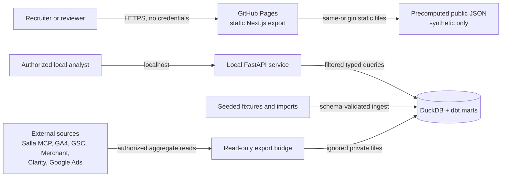
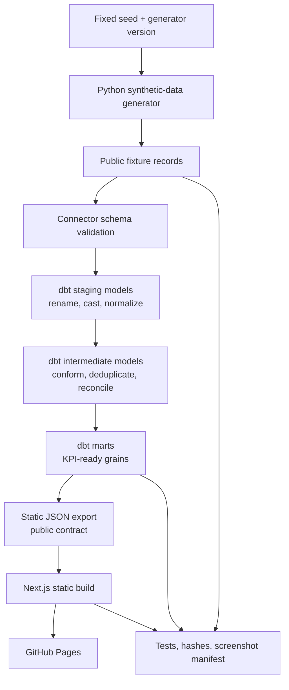
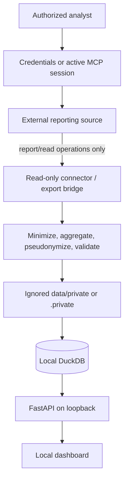
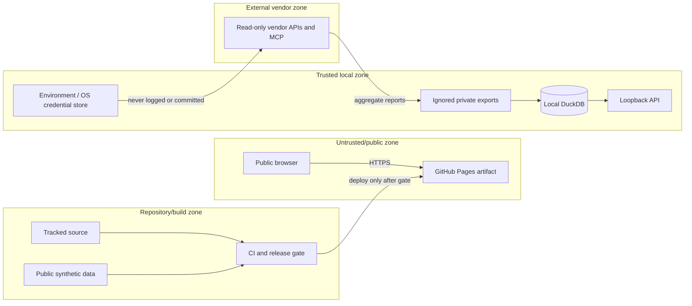
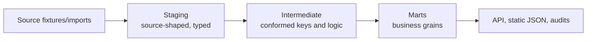

# Architecture

## Purpose and scope

PrimeOrder Commerce Intelligence is a portfolio-grade, read-only commerce measurement system. It has two deliberately different execution paths:

- `public-demo` is the default and the only mode permitted in builds, automated tests, screenshots, GitHub Pages, CV assets, social assets, and release archives. It uses deterministic synthetic data.
- `live-private` is a local-only path for privacy-safe aggregate exports from approved read-only sources. Its files remain under ignored private paths and never enter a public browser bundle.

The architecture answers commercial, funnel, acquisition, SEO, customer, measurement-quality, and source-reconciliation questions without turning the public application into a conduit to merchant systems.

## System context

The deployed public site does not call FastAPI, localhost, MCP, or vendor APIs. The local API and public static output expose aligned response shapes, but they are separate delivery mechanisms.

Implementation snapshot: the current FastAPI repository serves and filters generated `public-demo` JSON/CSV only. The diagrammed live-private DuckDB/API path is the governed target architecture; a live-private repository implementation, suppression policy and authenticated source extraction are not shipped or claimed complete.

## Containers and responsibilities

| Container | Responsibility | Inputs | Outputs | Security boundary |
|---|---|---|---|---|
| Next.js web application | Accessible EN/AR dashboard, static routes, filters, charts, tables, method notes | Precomputed public JSON | Static HTML, CSS, JavaScript, assets | Public; synthetic data only |
| FastAPI service | Health/readiness and typed filtered analytics endpoints | dbt marts | JSON responses and OpenAPI | Local machine; no direct public deployment |
| Connector layer | Normalize fixture, import, and optional live-read paths; validate schemas and expose freshness/status | Vendor reports, MCP reads, CSV/JSON, deterministic fixtures | Normalized records plus metadata | Credentialed boundary for live reads |
| Python data generator | Produce repeatable Saudi digital-commerce demo activity and documented anomalies | Fixed seed and generator version | Synthetic source files | Public and reproducible |
| DuckDB/dbt analytics | Stage, conform, reconcile, test, and aggregate | Normalized source files | Dimensions, facts, marts, tests, lineage | Local build; only selected public marts exported |
| Release tooling | Verify mode, tracked paths, secrets/PII, assets, and evidence | Repository and build outputs | Pass/fail evidence and public artifacts | Publication gate |

## Public-demo data flow

Reproducibility is defined by identical generator inputs producing byte-stable logical records. Generated timestamps that form part of the dataset must be deterministic; execution timestamps belong only in build evidence.

## Live-private data flow

The live path must not retain raw MCP responses, authorization metadata, direct customer identifiers, order references, addresses, contact details, private coupon codes, supplier costs, or other fields that are unnecessary for aggregate analysis. No live value may be copied into public documentation or screenshot evidence.

## Trust boundaries

Boundary controls:

1. **Public to deployment:** the browser receives only static public-demo assets; no credentials, private endpoints, or live records are embedded.
2. **Repository to deployment:** CI must prove `public-demo`, scan tracked content, and inspect intended release assets before deployment.
3. **Local to vendor:** authentication remains in environment/credential storage; connector operations are read-only and rate-limited.
4. **Private storage to analytics:** imports are minimized and validated before use; public export code must reject non-public mode.
5. **Analytics to UI:** marts expose aggregates at documented grains; suppressed or unavailable metrics remain unavailable rather than being inferred.

## Analytics layering and grain

- Staging models preserve source meaning while normalizing names, types, currencies, dates, and status values.
- Intermediate models deduplicate safe business keys, map products/channels, calculate item totals, align source dates, and flag quality defects. Raw rows are not silently discarded; exclusion reasons remain observable.
- Marts publish one explicit grain per model. Measures from different grains are never joined without pre-aggregation.
- Reconciliation keeps source-specific measures side by side. It does not average Salla and GA4 or treat one as a substitute for the other.

Target mart grains are documented in the [data dictionary](../analytics/DATA_DICTIONARY.md). KPI formulas and source precedence are defined in the [KPI catalog](../analytics/KPI_CATALOG.md).

## Contract strategy

Connector and consumer contracts include:

- schema version;
- source and connector identifier;
- data mode;
- status and last successful extraction time;
- reporting period, source timezone, and currency where relevant;
- freshness or staleness state;
- records or typed aggregate payload;
- non-secret warnings and error codes.

Status is data, not a badge inferred by the UI. Supported status vocabulary is `CONNECTED`, `READY_NOT_AUTHENTICATED`, `FIXTURE_MODE`, `UNAVAILABLE`, and `FAILED_WITH_EVIDENCE`. A connector may have a reachable external service while its repository adapter is still unverified; those facts must be displayed separately.

## Deployment topology

| Environment | Web data source | API | Private data allowed | Intended audience |
|---|---|---|---|---|
| Local public demo | Generated public JSON or public marts | Optional loopback | No | Developers and reviewers |
| Local live-private | Local filtered marts | FastAPI on `127.0.0.1` | Aggregate/minimized only | Authorized analyst |
| CI | Regenerated public fixtures and public marts | Test process only | No | Verification |
| GitHub Pages | Checked build-time public JSON | None | No | Recruiters/public |

The repository base path is a build concern for GitHub Pages. No client route may assume a root-domain deployment, and no public asset may request `127.0.0.1`, `localhost`, a private API, or an external analytics reporting API.

## Failure behavior and observability

- A connector failure returns a typed status and evidence reference; it does not fall through to fixtures without making the mode change visible.
- Freshness is calculated against source-specific expectations and displayed with the report period.
- Structured API logs include request identifiers, route, status, duration, and data mode, but exclude payloads, credentials, query values that could identify customers, and raw upstream errors.
- Empty states distinguish "no activity," "not authenticated," "unsupported by source," and "failed."
- The release gate is fail-closed for secrets, likely PII, tracked private paths, non-public mode, or private endpoints in public assets.

## Architecture qualities and trade-offs

| Quality | Choice | Consequence |
|---|---|---|
| Privacy | Static public delivery from independent synthetic data | Live exploration is intentionally local-only |
| Reproducibility | Fixed-seed generator, DuckDB, dbt, pinned dependencies | Public data represents capability, not PrimeOrder performance |
| Portability | Files plus embedded DuckDB | Not designed for high-concurrency production workloads |
| Explainability | Versioned KPI catalog and explicit source reconciliation | More metadata and documentation to maintain |
| Availability | Fixture/import path for every connector | Fixture success does not prove live authentication |
| Cost | GitHub Pages static hosting | No public server-side filtering or scheduled live refresh |

## Verification boundaries

This document describes the architecture contract. It is not evidence that every component has passed. Command outcomes, counts, hashes, connector observations, deployment URLs, and unresolved review findings belong in execution/testing evidence and must be updated only from actual results.
