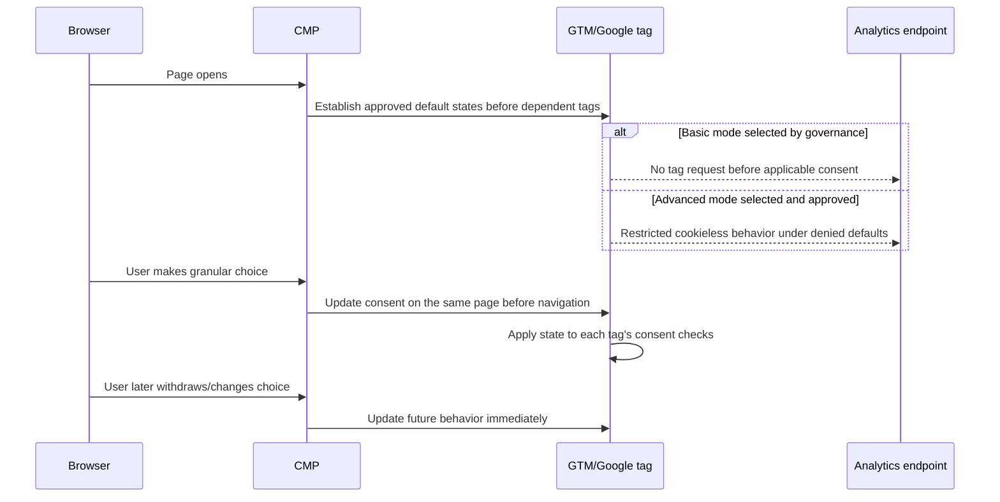

# Consent and EEA/German Measurement Notes

## Important boundary

This is an engineering and governance checklist for a portfolio project, not legal advice and not a compliance determination. PrimeOrder's controller, privacy counsel or data-protection adviser must decide the lawful basis, consent design, vendor configuration, international-transfer safeguards, retention, notices, and applicability for the actual storefront and audience.

## Why Consent Mode is not consent

Google Consent Mode communicates a user's state to supported Google tags and changes tag behavior. It does not create valid consent, replace a consent-management interface, select a lawful basis, or prove compliance. Google describes both basic mode (tags blocked until consent interaction) and advanced mode (tags load with denied defaults and can send cookieless measurements); the choice between them requires legal/privacy review, not only an analytics trade-off. See [Google's Consent Mode overview](https://developers.google.com/tag-platform/security/concepts/consent-mode).

## German/EEA baseline for engineering review

As of this document's review date:

- GDPR principles include purpose limitation, data minimisation, accuracy, storage limitation, integrity/confidentiality, and accountability. Consent is only one possible lawful basis and has specific validity/withdrawal requirements. See the official [GDPR text on EUR-Lex](https://eur-lex.europa.eu/eli/reg/2016/679/oj).
- Germany's [TDDDG §25](https://www.gesetze-im-internet.de/ttdsg/__25.html) addresses storing information in or accessing information already stored on an end user's terminal equipment. Consent is generally required unless a statutory exception applies, including strictly necessary cases described in the law.
- EDPB consent guidance emphasizes that consent must be freely given, specific, informed and unambiguous, and withdrawal must be as easy as giving consent. See [EDPB Guidelines 05/2020](https://www.edpb.europa.eu/documents/guideline/guidelines-052020-on-consent-under-regulation-2016679_en).
- German supervisory-authority guidance for telemedia is available through the [Datenschutzkonferenz's Orientierungshilfe Telemedien](https://www.datenschutzkonferenz-online.de/media/oh/20221130_OH_Telemedien_2021_Version_1_1.pdf). Its application to the exact implementation still requires professional review.

Do not label analytics or advertising storage “strictly necessary” merely because reporting is commercially useful. Necessity and legal basis are legal/controller decisions.

## Proposed consent-state mapping

The following is an implementation starting point for review, not a legal conclusion:

| Purpose | Consent Mode state | Conservative default in applicable EEA flow | Notes |
|---|---|---|---|
| Analytics storage | `analytics_storage` | `denied` | Update only from the applicable analytics choice. |
| Advertising storage | `ad_storage` | `denied` | Separate from analytics purpose. |
| Advertising user data | `ad_user_data` | `denied` | Requires explicit policy/vendor review. |
| Advertising personalization | `ad_personalization` | `denied` | Keep distinct from measurement. |
| Functionality/personalization storage | `functionality_storage`, `personalization_storage` | purpose-dependent | Do not couple to analytics automatically. |
| Security storage | `security_storage` | purpose-dependent | Security/fraud controls require their own necessity and privacy assessment. |

The CMP must be the source of truth for user choice. GTM should consume that state, not infer consent from page geography, referrer, login, or the presence of a cookie alone.

## UX and records checklist

- Provide clear purpose/vendor information before consent where required.
- Offer reject/decline and granular choices without deceptive emphasis or preselected optional purposes.
- Keep service access and core purchase flow independent from optional analytics/advertising consent unless counsel validates an exception.
- Make settings easy to reopen and withdrawal as easy as acceptance.
- Record the consent text/version, timestamp, region/context, selected purposes, and proof necessary for accountability while minimizing the record itself.
- Refresh consent when purposes/vendors materially change or the approved retention/re-consent policy requires it.
- Provide accessible EN/AR language appropriate to the audience; legal notices may require other languages depending on targeting.
- Ensure a user can complete essential account/purchase actions when optional consent is denied.

## Technical sequence

## Audit scenarios

Test these in an approved environment without creating a live order:

1. Clean browser, applicable EEA/German context, no interaction.
2. Accept analytics only.
3. Accept advertising only if the UI validly supports the separated purpose.
4. Reject all optional purposes.
5. Granular custom selection.
6. Revisit with stored choice.
7. Withdraw/change choice and navigate without reload.
8. Expired/version-changed choice.
9. EN and AR routes, desktop and mobile.
10. Unsupported/failed CMP script: fail-safe behavior must match the approved policy.

For each scenario record the banner state, consent default/update timeline, tags that fired, network destinations, storage created/read, relevant consent signals, and any console errors. Evidence must contain no personal or merchant-private data.

## Data minimization for GA4/GTM

- Do not send email, phone, customer name, postal address, account/customer ID, full order reference, IP-derived custom data, payment details, authorization results, support text, or search terms that may contain personal data.
- Disable or constrain collection features inconsistent with the approved purpose and notice.
- Review URL/query strings and page titles for accidental identifiers before sending page data.
- Use coarse geography in exported analysis and suppress small groups.
- Limit user-scoped custom dimensions and User-ID use to a separately justified, documented design.
- Align GA4 data retention, Google Signals, advertising features, data sharing, deletion handling, and access roles with the approved policy.
- Document international data transfers and vendor processor/controller roles outside this engineering repository as required.

## Consent audit interpretation

`consent_state_coverage` means the fraction of events for which an expected consent state was technically observable in the audited evidence. It is **not** a compliance score. Missing consent fields in a GA4 aggregate export can mean “not observable,” not necessarily “not implemented.” A technical `granted` signal does not prove the underlying consent was legally valid.

## Release decision

A new or changed live tag is not release-ready until the controller has approved the purpose/legal basis and notice, consent/CMP behavior has passed all applicable scenarios, prohibited data is absent, vendor settings/retention/access are reviewed, and rollback is documented. This portfolio repository makes no claim that those live approvals occurred.
