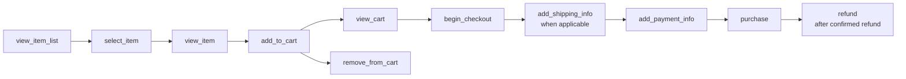

# Measurement Plan

## Objective

Create a reliable, explainable commerce-measurement baseline for PrimeOrder without changing the live storefront or exposing private data. The plan supports commercial reporting, a session-based funnel, product/category analysis, acquisition, source reconciliation, and a structured backlog of measurement improvements.

This repository specifies and audits the target contract. It does **not** claim that the contract has been deployed to the live store. Any live change to GTM, GA4, consent, checkout, or Salla requires a separately authorized implementation and validation cycle.

## Measurement principles

1. Use PrimeOrder/Salla official commerce reporting as the primary source for orders, revenue, discounts, refunds, payment and product/category performance.
2. Use GA4 for users, sessions, behavioral funnel events, and GA4-attributed acquisition.
3. Reconcile sources side by side; never average disagreement away.
4. Send one semantically correct event at the business moment it represents.
5. Never send names, emails, phone numbers, addresses, customer IDs, full order references, payment data, credentials, or free-text fields that may contain personal data to the data layer or analytics.
6. Use opaque transaction IDs for purchase/refund deduplication and reconciliation. In public-demo they are invented; live handling requires a privacy review and must never enter public artifacts.
7. Apply consent behavior before analytics/advertising tags execute and preserve observable consent state where lawful and technically available.
8. Treat unavailable, unauthenticated, stale, or privacy-suppressed measurements as unavailable—not zero.

## Business questions and measures

| Question | Primary measures | Primary source | Main risks |
|---|---|---|---|
| What is selling? | completed orders, units, gross/net revenue, refunds, AOV | Salla commerce reports | status mapping, refund timing, tax/discount scope |
| Where does the funnel lose sessions? | sessions reaching product view, cart, checkout and purchase; step rates | GA4 | consent, blockers, cross-domain checkout, duplicates |
| Which products/categories contribute? | units, revenue share, refund rate, margin only with reliable cost | Salla | product mapping, bundle/allocation, cost reliability |
| Which acquisition performs? | users, sessions, campaign revenue; CPA/ROAS conditionally | GA4 + Ads | attribution model, currency, spend/conversion mismatch |
| Are sources aligned? | transaction and revenue absolute/relative variance | Reconciled Salla/GA4 | timezone, currency, status and revenue-scope mismatch |
| Is measurement trustworthy? | event coverage, parameter completeness, duplicates, unknown items, freshness, event order, consent observability | Audit marts | incomplete exports can mean not observable |

KPI formulas and grains are controlled by the [KPI catalog](../analytics/KPI_CATALOG.md).

## Target funnel

Digital products may not require shipping. If no real shipping-information step exists, mark `add_shipping_info` as `NOT_APPLICABLE` with evidence; do not manufacture the event to complete a funnel.

## Event ownership and trigger moments

| Event | Trigger moment | Owner/system | Deduplication expectation |
|---|---|---|---|
| `view_item_list` | A meaningful item list is rendered and visible | Storefront | Once per list impression/render, with documented virtual-navigation behavior |
| `select_item` | User activates a specific item from a list | Storefront | Once per activation |
| `view_item` | Product detail becomes the active view | Storefront/router | Once per product view/virtual page view |
| `add_to_cart` | Cart state confirms item/quantity was added | Commerce UI | One event for the confirmed delta, not button intent alone |
| `remove_from_cart` | Cart state confirms item/quantity was removed | Commerce UI | One event for the confirmed delta |
| `view_cart` | Cart view becomes active | Storefront/router | Once per cart view |
| `begin_checkout` | User enters the actual checkout flow | Storefront/checkout | Once per checkout entry unless a clearly new attempt starts |
| `add_shipping_info` | Valid shipping/delivery selection is accepted | Checkout | Not applicable if the digital-goods flow has no such step |
| `add_payment_info` | Non-sensitive payment-method selection is accepted | Checkout | Never include card/account fields |
| `purchase` | Backend/storefront confirms a unique completed transaction | Order confirmation | Unique stable `transaction_id`; not on payment-button click |
| `refund` | Merchant system confirms full or partial refund | Trusted server/offline workflow | Reference original transaction; avoid client-side secret |

## Parameter policy

- Event monetary `value` is the sum of `price × quantity` for included items after item-level discount according to one documented convention. Shipping and tax are separate and not silently included.
- `currency` uses an ISO 4217 uppercase code and is present whenever `value` is sent; it is mandatory for purchase reporting in this project.
- Each item has at least one stable `item_id` or `item_name`; this project requires both where the storefront provides them safely.
- `price` and `quantity` are numeric and non-negative; default quantity is made explicit rather than relying on an implicit value.
- Category names use a governed hierarchy. Unknown items/categories are sent as explicit mapping defects, not dropped.
- Coupon/promotion values must not contain private customer-targeted codes in public evidence.
- Custom parameters require a purpose, owner, retention review, and registered custom dimension/metric only when reporting needs it.

The full per-event contract is in [GA4_EVENT_SPEC.md](GA4_EVENT_SPEC.md).

## Source alignment rules

Before calculating Salla–GA4 variance, establish:

- identical inclusive date window and reporting timezone;
- identical currency and no hidden conversion;
- completed/valid commerce status mapped to valid GA4 `purchase` semantics;
- duplicate and missing transaction-ID treatment;
- comparable revenue components (items, discounts, tax, shipping, refunds);
- refund attribution by effective date or purchase cohort, clearly named;
- freshness of both extracts;
- any GA4 thresholding, sampling, consent loss, browser blocking, or cross-domain break.

If scope cannot be aligned, variance is unavailable with a reason code. The commerce number remains the financial operational reference; GA4 remains the behavioral/attribution reference.

## Data-quality rule families

| Rule family | Example failure | Severity guidance |
|---|---|---|
| Event coverage | Applicable recommended event absent in the audit period | High for `purchase`; medium for upstream discovery steps; informational if not applicable |
| Required parameters | `purchase.transaction_id`, `currency`, `value`, or `items` missing | Critical/high when revenue or deduplication is affected |
| Type/domain | Negative quantity, malformed currency, empty item array | High |
| Reconciliation | `value` differs from item total beyond numeric tolerance | High for purchase/refund, medium upstream |
| Duplicate | Repeated purchase with same transaction ID | High |
| Product mapping | Unknown `item_id` | Medium; high if material value share |
| Sequence | Purchase observed without checkout/product events | Medium; can indicate consent/session/cross-domain gaps rather than impossible behavior |
| Freshness | Report-through timestamp exceeds connector SLA | Medium/high based on decision impact |
| Consent | Default/update absent or inconsistent where observable | High pending privacy/legal review |
| Source variance | Transactions/revenue outside governed tolerance | High only after scopes align |

Thresholds are configuration, not universal truths. The audit must record the threshold version and affected denominator.

## Validation lifecycle

1. Validate the data-layer object against the event schema in developer tests.
2. Use GTM Preview/Tag Assistant in a non-production or approved test context to inspect trigger, variables, consent, and tag sequence.
3. Use GA4 DebugView to confirm event and item parameters; allow reporting latency before judging standard reports.
4. Test duplicate prevention with an approved non-live transaction fixture, not a real customer checkout.
5. Query GA4 reporting/API after processing and reconcile with a matching commerce fixture/export.
6. Monitor event counts, parameter completeness, unknown items, freshness, and source variance over time.
7. Release changes through versioned GTM workspaces/environments with owner review and rollback notes.

## Reporting and ownership cadence

| Cadence | Review | Owner |
|---|---|---|
| Per build | Schema, synthetic anomalies, KPI regression, release/privacy gate | Data Engineering |
| Daily when live | Connector freshness, failed loads, purchase completeness, duplicates | Analytics Operations |
| Weekly | Funnel shifts, product mapping, source variance, consent observability | Digital Analytics + E-commerce |
| Monthly/after release | Event spec, GTM versions, custom dimensions, retention, access | Measurement Owner + Privacy/Security |

## Success criteria

- Every applicable funnel event has a stable trigger and validated parameters.
- `purchase` is deduplicated by a valid transaction ID and reconciles to item totals.
- Salla/GA4 variances are explainable within governed scope or visibly unresolved.
- Consent defaults and updates are observable and tags respect the chosen policy.
- Public evidence contains synthetic data only.
- Audit findings have severity, evidence, affected KPI, owner, and next action.

These are acceptance criteria, not claims of current live-store success.

