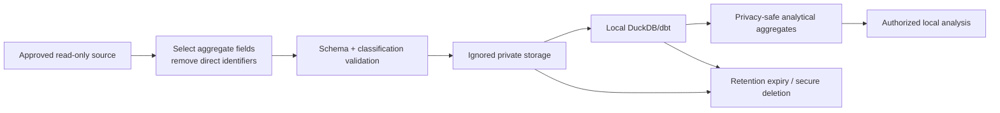

# Privacy Design

## Scope and posture

PrimeOrder Commerce Intelligence is designed to demonstrate commerce analytics without making customer or merchant-confidential data public. The repository is a portfolio implementation, not a legal opinion, data-protection impact assessment, or statement that a live storefront is compliant.

The controlling privacy invariant is:

> Every public build, test, screenshot, CV/social asset, GitHub Pages deployment, and release artifact uses independent deterministic synthetic data and contains no real customer or revenue information.

## Design principles

- **Data minimization:** ingest only the fields needed for a named business question.
- **Purpose separation:** commerce operations, behavioral measurement, advertising, SEO and diagnostics retain their source semantics and governance.
- **Public/private separation:** public-demo and live-private have different storage, build and delivery paths.
- **No public derivation:** synthetic values are not scaled, perturbed, modeled, or reverse-engineered from PrimeOrder private metrics.
- **Aggregate first:** live analysis prefers official aggregates; customer/order-level records are exceptional local inputs, not defaults.
- **Safe failure:** missing authentication/data returns an explicit status; it does not trigger a private fallback or masked publication.
- **Accountability:** source, mode, freshness, schema, quality and evidence accompany analytical outputs.
- **Least retention:** raw/minimized imports and generated databases live only as long as the approved analysis/reproducibility need.

## Data modes

| Property | `public-demo` | `live-private` |
|---|---|---|
| Purpose | Recruiter evaluation, automated tests, public evidence | Authorized local business analysis |
| Default | Yes | No; explicit local selection only |
| Data origin | Fixed-seed independent synthetic generator | Approved read-only aggregates/imports |
| Credentials | None | Tool/OS/env-managed, never committed |
| Storage | Tracked public fixture/static output | Ignored `data/private/`, `.private/`, local DB/cache |
| Browser delivery | Static GitHub Pages allowed | Loopback-only UI/API; no public deployment |
| Screenshots/CV/social/release | Allowed with visible synthetic label and review | Prohibited |
| Identifiers | Invented demo values | Direct identifiers prohibited; local pseudonym only if necessary/reviewed |

## Data lifecycle

The public lifecycle is a separate fixed-seed generator-to-static-build path and never receives nodes from this live-private flow.

## Minimization decisions

| Input | Decision | Reason |
|---|---|---|
| Customer name, email, phone, address | Do not ingest/retain | Not required for aggregate KPI questions; high disclosure risk |
| Full order reference | Do not expose; avoid retaining | Operational identifier can link to a person/order; analytics uses safe keys/counts |
| Stable customer identity | Unavailable by default; local pseudonym only for justified repeat/cohort analysis | Enables linkage/re-identification; most KPIs do not require it |
| Exact timestamp | Reduce to reporting date where sequence is unnecessary | Lowers uniqueness while preserving trend questions |
| City/region | Aggregate and suppress small live groups | Location combined with other dimensions can identify a customer |
| Coupon/promotion | Use synthetic public codes; aggregate/pseudonymize private codes | Private/targeted codes can reveal campaigns or individuals |
| Product/catalog values | Public demo is invented; live names/IDs stay local unless classified safe | Merchant strategy/catalog can be confidential |
| Revenue/order metrics | Public demo only; live values remain local and are never quoted in public docs | Commercial confidentiality |
| Supplier costs/margin inputs | Local restricted and conditional; no public live values | Highly confidential commercial data |
| Raw MCP/API response | Do not persist | Can contain undocumented fields, identifiers and auth metadata |
| Source credentials/auth metadata | Never ingest or log | Secret/credential compromise risk |
| Analytics payload/URL | Validate and remove PII/free text | URLs/search/payment/error fields can carry identifiers |

## Pseudonymization and aggregation

Pseudonymization is a security control, not anonymization. A keyed hash can still be personal data and the key/secret must not enter the repository. Use a rotating, environment-held key only where stable linkage is necessary. Never hash low-entropy fields such as phone/email without an approved keyed design; unsalted hashes are vulnerable to reversal.

For live reporting:

- prefer daily aggregate facts over events/orders;
- limit dimension combinations;
- enforce minimum group sizes where disclosure risk exists;
- bucket rare values into `other`/`suppressed` without leaking the suppressed count indirectly;
- retain `unknown` separately for data-quality transparency;
- review differencing risk across filters/exports.

No fixed minimum-group threshold is asserted here because it depends on the population, fields and risk assessment. The project must record the chosen rule before enabling live-private breakdowns.

## Retention recommendations

These are proposed maxima for owner/privacy review, not proof of automated enforcement:

| Data | Proposed retention | Rationale/action |
|---|---|---|
| Credentials/tokens | Session/provider policy; never repository storage | Revoke/rotate on exposure or loss of need |
| Raw live exports | Delete after validated minimized import, target within 7 days | Highest field-level risk |
| Minimized live analytical extracts | Up to 90 days unless a documented business/legal need requires less/more | Reassess necessity and refresh rather than accumulate |
| Local analytical database from live data | Up to 90 days; rebuildable | Delete with extracts when analysis closes |
| Pseudonym linkage material | Shortest feasible period; separate from analytics | Delete when cohort/repeat analysis ends |
| Security/audit logs | 30–90 days, payload-free | Incident/troubleshooting value with minimized content |
| Synthetic public fixtures | Version-controlled while supported | Contains no live information |
| Public evidence/manifests | Release lifetime | Contains hashes/status only after privacy review |

Deletion must include derived databases, caches, temporary exports, screenshots, archives and backups within the operator's control. Version control cannot safely erase a committed secret/private record; prevention and immediate incident handling are essential.

## Logging policy

Allowed: request ID, route name, result status, connector ID, selected mode, duration, row count, schema version, report-through date, retry category, safe error code, evidence path.

Prohibited: headers, tokens, cookies, auth URLs/codes, request/response bodies, SQL containing values, customer/order identifiers, emails/phones/addresses, exact private totals in public logs, stack traces containing secrets, raw MCP output.

Logs use structured fields, truncate attacker-controlled text, and are local/CI scoped. Public CI logs must be treated as public data.

## Screenshots and generated assets

Every public screenshot must:

- show the synthetic-data disclosure;
- be captured in `public-demo` mode from the intended route/viewport/language;
- contain no browser chrome, notifications, account identity, local path, private URL, developer tools, hidden overlays or stale live data;
- have a manifest entry with commit SHA, timestamp, viewport, language, mode, hash, intended use, alt text and privacy-review result;
- be OCR/text and visually reviewed where practical;
- fail publication if provenance/mode is unknown.

Architecture and social/CV assets derived from screenshots inherit the screenshot classification and must be re-reviewed after composition.

## Public release privacy gate

The gate is fail-closed for:

1. mode other than `public-demo`;
2. tracked `data/private/`, `.private/`, local databases, env/credential files or raw exports;
3. likely secrets, authorization metadata or high-risk PII patterns;
4. public bundle references to localhost/private endpoints or vendor reporting APIs;
5. screenshot/media without a passing privacy manifest;
6. release archive contents that differ from reviewed inputs;
7. exact private metrics or unsupported business-result claims;
8. unknown binary/license provenance.

Automated pattern scans reduce risk but do not prove absence. A reviewer inspects tracked files, build output, screenshots, archives and Git history before first publication.

## Data-subject and controller operations

This portfolio does not implement a production data-subject request workflow. If live-private data is used, the controller must know what was processed, the source/purpose, lawful basis, retention, recipient/access, and deletion/export capability. Because direct identifiers are intentionally excluded, avoid promising that a pseudonym can always be linked back to a person. Escalate access/erasure/correction/objection requests through the controller's approved privacy process.

## Accidental exposure response

1. Stop publication/deployment and preserve safe, non-sensitive evidence.
2. Remove public access to affected artifact where possible; do not rely on a follow-up commit alone.
3. Identify exact fields, records, people/systems, commits, caches, releases and download exposure.
4. Revoke/rotate exposed credentials immediately through the provider; do not paste them into the incident record.
5. Notify the project owner/security/privacy contact through an approved private channel.
6. Evaluate legal/contractual notification duties with qualified advisers and applicable deadlines.
7. Purge local/public derivatives, rewrite Git history only through a reviewed coordinated process, and invalidate artifacts/hashes.
8. Fix the control failure, rerun the full release gate, and document a privacy-safe post-incident review.

See [DATA_CLASSIFICATION.md](DATA_CLASSIFICATION.md), [THREAT_MODEL.md](../security/THREAT_MODEL.md), and [PUBLIC_RELEASE_CHECKLIST.md](../security/PUBLIC_RELEASE_CHECKLIST.md).

