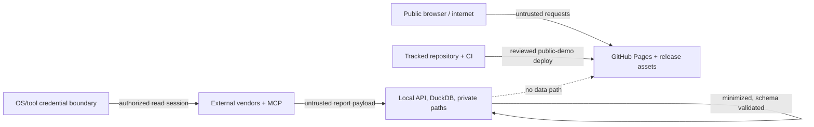

# Threat Model

## Scope

This threat model covers the repository, deterministic generator, connector/import paths, local DuckDB/dbt/FastAPI stack, Next.js static public build, CI/release pipeline, screenshots and portfolio archives. It excludes vendor internal controls, the live Salla storefront implementation, and the user's broader device/account security except where this project directly interacts with them.

## Security objectives

1. No credential, PII, live merchant metric, raw connector response or authorization metadata is exposed.
2. External connector behavior remains read-only.
3. Public artifacts are reproducibly derived only from independent synthetic data.
4. Analytical results retain source, scope, freshness and quality so they are not misleading.
5. CI, dependencies, generated assets and releases do not introduce unauthorized code/data.
6. Local services do not become unintentionally network-accessible or log sensitive payloads.

## Assets and impact

| Asset | Confidentiality | Integrity | Availability impact |
|---|---|---|---|
| Connector credentials/sessions | Critical | High | Live reads unavailable; account compromise possible |
| Customer/order identifiers | Critical | High | Privacy harm and notification duties |
| Exact merchant metrics/costs | High | High | Commercial harm and misleading decisions |
| Public synthetic dataset | Low | High | Portfolio credibility/reproducibility harmed |
| KPI/dbt logic | Medium | High | Wrong business decisions and recruiter evidence |
| Connector status/evidence | Medium | High | False connectivity/quality claims |
| CI/release workflow | Medium | Critical | Malicious artifact or data leak publication |
| Screenshots/CV/social archives | Public after review | High | Irreversible redistribution of leak/misstatement |

## Actors

- Accidental contributor or analyst copying private data into a tracked/generated path.
- External attacker targeting credentials, local services, dependencies, CI or release artifacts.
- Malicious/compromised upstream dependency or action.
- Untrusted imported CSV/JSON content designed to exploit parsers, formulas, logs or generated UI.
- Curious public reviewer attempting routes, source maps, static assets or malformed filters.
- Vendor/API failure returning unexpected fields, partial data, rate-limit errors or misleading status.

## Trust boundaries

The dashed relationship is intentionally absent: live-private output must not flow into the public deployment.

## Threat register

| ID | STRIDE | Threat scenario | Impact | Primary controls | Residual risk / verification |
|---|---|---|---|---|---|
| `T01` | Information disclosure | `.env`, token, cookie, service account, auth URL or raw MCP output is committed/logged | Critical credential/private-data exposure | ignored private paths; env names only; secret/PII/history scan; provider secret stores; logging denylist | Scanners miss novel formats; human review and rotation drill required |
| `T02` | Information disclosure | Live dataset/database is copied into public JSON, screenshot or archive | Critical privacy/commercial leak | hard `public-demo` gate; separate paths; synthetic label; artifact manifest/hash; screenshot review | Generated/binary content needs explicit inspection |
| `T03` | Tampering | Mode flag or build path is changed to make live data appear public | Critical | fail-closed mode assertion in build/release/CI; no public client connector; reviewed workflow | Workflow/control implementation must be tested, not documented only |
| `T04` | Tampering | Duplicate/malformed source rows corrupt revenue/funnel KPIs | High decision-integrity risk | schema validation, deduplication, business invariants, reconciliation and quality marts | Valid-looking but semantically wrong upstream data remains possible |
| `T05` | Spoofing | Fixture output or discovery call is represented as live `CONNECTED` reporting | High credibility/decision risk | typed status + mode + capability scope; evidence reference; no silent fallback | Documentation/status artifact can drift without automated consistency test |
| `T06` | Elevation/tampering | Connector uses mutation endpoint or excessive OAuth scopes | Critical live-store/account change | MCP-only read-only Salla path; allowlisted read operations; least scopes; no mutation UI/code; review | Vendor/tool scope may be broader than used; account-side review needed |
| `T07` | Denial of service | Unbounded API pagination/retry/import exhausts quota, CPU, memory or disk | Medium | bounded pages/rows/retries; timeouts; backoff/jitter; file-size/schema limits | Very large valid reports still need operational limits |
| `T08` | Injection | Malicious CSV/JSON values trigger SQL, formula, HTML/script, path or log injection | High | typed parsers; parameterized SQL; no spreadsheet formula execution; React escaping; safe filenames; log sanitization | Export to office tools and markdown rendering require continued review |
| `T09` | Information disclosure | API/log/error exposes query values, stack trace, private totals or identifiers | High | structured payload-free logs; safe error envelopes; production debug off; loopback bind | Third-party library logs can bypass policy; inspect test logs |
| `T10` | Spoofing/info disclosure | Local API binds all interfaces or permissive CORS exposes private marts | High | bind `127.0.0.1`; narrow/no CORS; no public deployment; host/firewall check | Local malware or shared-host users remain outside app boundary |
| `T11` | Supply chain | Compromised npm/Python/GitHub Action dependency executes in build/CI | Critical | pinned lockfiles/versions/SHAs where feasible; minimal permissions; dependency review/scans; no secrets in public build | Registry/action compromise cannot be eliminated |
| `T12` | Repudiation | Test/release claims lack commit, time, hash or command evidence | High portfolio/release integrity risk | evidence manifests; immutable commit/tag; structured review findings; release checklist | Maintainer can still publish outside process |
| `T13` | Information disclosure | Source maps/static assets include localhost/private endpoint or embedded data | High | bundle string scan; static-only architecture; artifact inspection | Obfuscated/minified content and third-party assets need scanning |
| `T14` | Information disclosure | Rare geography/coupon/customer cohorts re-identify individuals | High | aggregate first, suppress small groups, limit dimension combinations, no direct IDs | Differencing across filters can leak suppressed groups |
| `T15` | Tampering | Public screenshot/social graphic is stale, edited or from live-private mode | High | capture manifest with route/mode/commit/hash/privacy result; visible disclosure | Manual composition can break provenance; re-hash/review final derivative |
| `T16` | Information disclosure/repudiation | Consent state absent or misleading; tags collect outside approved choice | High legal/privacy risk | consent defaults before tags, granular update, Tag Assistant scenarios, controller/legal sign-off | Technical signal does not prove legally valid consent |
| `T17` | Tampering | GitHub Pages workflow is altered to deploy unreviewed artifacts | High | protected branch/environment where available, least Actions permissions, artifact provenance, workflow review | Repository account compromise remains critical |
| `T18` | Information disclosure | Git history retains private data after current file deletion | Critical | pre-first-push history scan; avoid commit; coordinated purge and credential rotation on incident | Forks/caches/downloads may retain already published content |

## Abuse cases and controls

### Private-to-public path confusion

An operator builds while `DATA_MODE=live-private`, then runs the normal export or screenshot task. Required defenses are multiple: the exporter rejects the mode; frontend has no live data path in public export; the release gate checks mode and artifacts; screenshot includes a visible synthetic label; manifest records mode; reviewer inspects content.

### Connector status inflation

An account-discovery call works, so UI reports all GA4 capabilities connected. The connector contract instead attaches status to the exact capability. Discovery can be `CONNECTED` while report/event-parameter capability is unverified. Fixture mode remains explicit.

### CSV injection and hostile content

An imported field begins with `=`, `+`, `-`, or `@`, contains HTML/script, a path traversal string, control characters, or oversized text. The system parses data as typed values, never executes spreadsheet formulas, escapes output, restricts filenames to controlled destinations, bounds size, and rejects unexpected fields. Any later CSV/XLSX export must neutralize formula-leading text.

### Source reconciliation manipulation

Different timezones/statuses/revenue components make variance look favorable. The mart refuses percentage variance unless comparison-scope flags pass; both raw aggregate source values and explanation codes remain available locally; public demo anomalies are labelled synthetic.

## Security assumptions

- The analyst's OS account and provider sessions are appropriately protected.
- Vendor tools honor the requested read-only operations, but returned content remains untrusted.
- GitHub and package registries can fail or be compromised; pinned, reviewed inputs reduce but do not remove that risk.
- GitHub Pages is public and all deployed bytes must be treated as indefinitely redistributable.
- Public synthetic data contains no hidden derivation from merchant data.

## Review triggers

Revisit this model when adding a connector, changing authentication/scopes, enabling a public API/server, introducing customer-level analysis, changing hosting/CI, adding a new export/media format, changing consent/measurement implementation, or after any incident/material dependency vulnerability.

